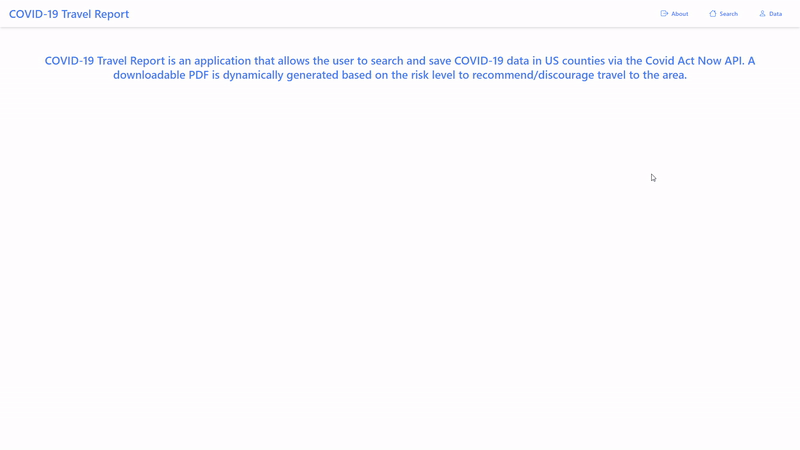

# Covid Travel Doc
## About
A full stack web app developed with React, Node.js, Express.js, PostgreSQL, and Docker. The app allows the user to search for COVID-19 data in US counties, save the data, and create dynamic, downloadable PDFs based on risk of travel to the location. 
## Preview

## Technologies
- React
- Tailwind CSS
- Node.js
- Express.js
- PostgreSQL
- Docker
## Installation
Clone the repository. In the server and client directories run:
```
npm install
```
Enter psql and run the last two commands in DATABASE.SQL to create your database and table. Create a .env file within the server directory and copy the content from blank.env into it and add your postgres user, password, and database name. Note: for the api key, you must register for one at https://covidactnow.org/data-api.

From the root directory, build the docker containers. 
```
docker build -t "backend" ./server/
docker build -t "frontend" ./client/
```
Run ```docker compose up``` to run your containers. There is no database yet within the postgres container. To create the database, connect to the psql console of the container:
```
docker exec -it postgres psql -U postgres
```
Run all three commands in DATABASE.SQL to create a new user, database, and table. Update the .env file if needed.

Shut down your containers using ```ctrl-c``` and restart your containers using ```docker compose up```.

View the application on http://localhost:3000/.
